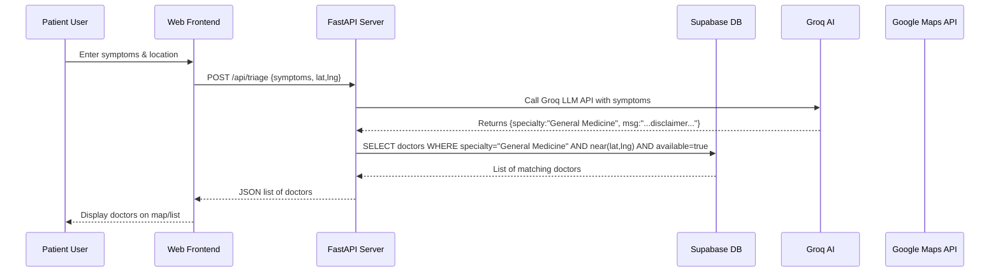
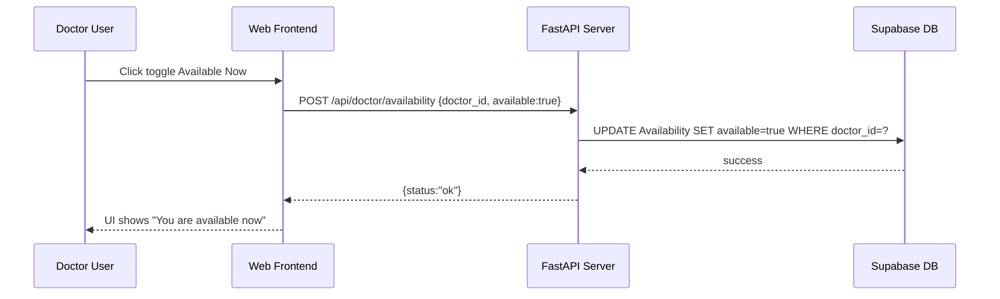

# Executive Summary  
Kerala’s high smartphone and internet penetration (among India’s highest) coupled with doctor shortages (India has only ~1 doctor per 1,445 people) creates strong demand for better doctor discovery and triage tools.  Existing platforms (Practo, DocSmart, Owlly) already list thousands of doctors nationwide, but none focus on *real-time* availability or free-tier AI-driven triage for local clinics.  We propose an MVP web platform where doctors create verified profiles (clinic address, specialties, hours) and can toggle **“Available Now”**.  Patients search by location/map or describe symptoms; an AI assistant (using Groq’s free LLM API) suggests a specialty and shows nearby available doctors.  This plan details the end-to-end business logic (user stories, entities, workflows, verification, fraud prevention, pricing, KPIs) and the technical stack (FastAPI, Supabase or equivalents, Google Maps, Groq AI, open models), with diagrams (ER, flow, sequence, architecture).  We outline a dev roadmap (milestones, timeline, team, costs), and cover Indian regulations (ABHA/UHI, DPDP/HIPAA best-practices, consent).  Finally, we propose a Kerala-focused launch strategy (target cities, doctor categories, incentives, partnerships) and testing/metrics to validate product–market fit.  

# Market Landscape & Business Logic  
**User Needs:** Patients in Kerala currently find doctors via word-of-mouth or generic apps (e.g. Practo covers Ernakulam and other Kerala cities). They lack a way to see *live* availability or get AI-assisted triage. Doctors in smaller clinics are under-served by large booking platforms (which often prioritize big hospitals).  

**Key Users & Stories:**  
- **Doctor:** “As a doctor, I want to create a profile (with my license no., specialities, clinic address & hours), get verified, and toggle **Available Now** so nearby patients can see I’m online.”  
- **Patient:** “As a patient, I want to enter symptoms or select a specialty, see nearby doctors on a map (with filters by distance/specialty/availability), and contact or book them instantly.”  

**Entities:** Core data entities include *Doctor*, *Clinic (Location)*, *Availability*, *Patient*, and *Appointment*.  Each Doctor can have one or more clinic locations, working hours, and a real-time availability flag. Patients have profiles (linked to ABHA health IDs if used) and search logs. Appointments link doctors and patients with date/time/status. A simple ER model is shown below:

```mermaid
erDiagram
    DOCTOR {
        int id PK
        string name
        string specialty
        string abha_id    %% linking to Health Professional Registry if available
        string license_no
        string email
    }
    CLINIC {
        int id PK
        string name
        string address
        float latitude
        float longitude
    }
    PATIENT {
        int id PK
        string name
        string abha_id    %% linking to patient’s Health ID (ABHA)
        string email
    }
    AVAILABILITY {
        int id PK
        bool available
        timestamp updated_at
    }
    APPOINTMENT {
        int id PK
        date date
        time time
        string status    %% e.g. pending, confirmed, completed
    }
    DOCTOR ||--|{ CLINIC : practices_at
    DOCTOR ||--|{ AVAILABILITY : "sets"
    DOCTOR ||--o{ APPOINTMENT : has_appointments
    PATIENT ||--o{ APPOINTMENT : books
```

**Workflows:**  
- *Doctor Onboarding:* Doctor registers with email and password, submits medical license/Aadhaar for verification (manual or via ABHA’s Health Professional Registry). Upon approval, they create a profile listing specialties, consultation fees, clinic(s) and hours. They set their status to “Available Now” via a toggle in the app, which sets an `Availability` flag in the DB.  
- *Patient Search:* A patient logs in (optionally with ABHA health ID) and enters location (or auto-detected via browser), then either: (a) selects a specialty or types symptoms into an AI chat widget, or (b) taps “Find Doctors Nearby” on the map. For symptom input, we call the AI triage service, which returns a recommended specialty. The backend then queries doctors matching specialty and nearby (using latitude/longitude and distance filter). The UI displays doctors on a map and list, highlighting those marked “Available Now”.  
- *Appointment Booking / Contact:* Patients click a doctor to see details (profile, fees, reviews). They can call or message the clinic directly, or request an appointment slot via the app (if implemented). For MVP, we may simply provide contact info and let patients walk in when the doctor is available. An *Appointment* record is created (for analytics and later scheduling features).  
- *AI Triage:* Upon patient symptom entry, we send symptoms + context (age, location) to the AI API. The AI returns a recommended specialty (e.g. “Ophthalmology”) and suggested risk info (with disclaimers). The backend then lists doctors of that specialty nearby. (We must clearly disclaim the AI is not giving medical advice, only suggesting which specialist to see.) Groq’s free-tier API (and fallback LLMs) handles the query (see “AI Stack” below).  

**Edge Cases & Fraud Prevention:**  
- **Fake doctors:** All doctor sign-ups must be validated. We require their registration number from the Indian Medical Register (state council) or upload license scan. The system cross-checks with Kerala State Medical Council or ABDM’s HPR if possible. Any discrepancy (duplicate license, ghost address) triggers manual review. Periodic audits ensure inactive or fraudulent profiles are flagged.  
- **Availability conflicts:** A doctor may forget to toggle off after leaving. We plan automated reminders (e.g. push notification after 8 hours continuous “available”). For booking, we could implement simple conflict-checking (disallow overlapping appointments).  
- **No-shows:** For MVP, we’ll avoid prepaid bookings (so no refunds issues). In future, ratings/comments can discourage no-shows.  
- **Data duplicates:** A doctor with multiple clinics should create separate entries or list both addresses; merging duplicates is an admin task.  

**Pricing Model & Incentives:**  
We recommend a **B2B2C freemium** model (inspired by Practo). Listing and search remain free for patients. Doctors/clinics get basic listing free (to build critical mass), with paid options: e.g. monthly subscription for enhanced features (practice management, visibility boosts) and transaction fees per online booking. Practo, for instance, uses per-appointment fees and subscriptions (Practo Ray). Initially, we may waive fees to onboard doctors in Kerala (perhaps offering a free trial). If we introduce payments (for teleconsult or bookings), a platform fee (~20–25%) could apply. Pharmacies/labs could later advertise or integrate too. Pricing must comply with UHI guidelines: all consultation fees must be visible (India’s UHI requires *transparent pricing*, providers display consultation fees).  

**Key KPIs:** We will track both supply-side and demand metrics:  
- *Doctors onboarded & verified* (target: hundreds in launch cities within 3–6 months).  
- *Active doctors* (monthly % toggling “available”).  
- *Patients reached & active* (DAU/MAU, retention).  
- *Search-to-contact conversion* (how many searches lead to calling or booking).  
- *Bookings made* (if implemented).  
- *Time to connect* (average time from search to patient–doctor contact).  
- *AI usage metrics* (symptom queries per day, specialty suggestions accuracy feedback).  
- *Feedback/CSAT*: user ratings for usefulness of search and AI suggestions.  

# Technical Architecture  

We adopt a **web-first MVP** (mobile-responsive site) built on a free-tier stack.  The high-level architecture is:

```mermaid
graph LR
  subgraph Client
    Browser(Web App)
  end
  subgraph Backend
    API[FastAPI Backend]
    DB[(Supabase Postgres DB)]
    AuthService(Auth/Supabase Auth)]
    AIService((Groq AI API))
    MapsAPI[Google Maps/Places API]
    ABHAAPI(ABHA/UHI APIs)
  end
  Browser --> API
  API --> DB
  API --> AuthService
  API --> AIService
  API --> MapsAPI
  API --> ABHAAPI
```

**Components:**  
- **Frontend (Browser/Web App):** Built with React (or similar) for quick iteration. Allows doctor/patient login, maps display (using Google Maps JS SDK), forms for profiles and search. Can be hosted on a free tier (e.g. Netlify/Vercel).  
- **Backend (FastAPI):** Handles API endpoints. FastAPI (Python) is lightweight, async, and works well with modern Python tools. It interfaces with the DB and external services. It enforces business logic (e.g. verifying tokens, applying filters). FastAPI’s dependency injection and automatic documentation are helpful for rapid dev.  
- **Database (Supabase/Postgres):** Supabase (hosted Postgres) offers Auth, DB and storage. Free tier gives 500MB DB and generous API limits. We use Supabase Auth for user (doctor/patient) management (email/password, JWT). Data (doctors, clinics, patients, appointments) is stored in Postgres tables (see Data Schema below). RLS (Row-Level Security) policies enforce multi-tenancy and privacy (doctors can only modify their own data). Supabase also provides real-time functionality and storage if needed (e.g. profile images). Alternative free-tier options include Firebase (Firestore) or MongoDB Atlas (512MB), but Supabase is preferred here for Postgres features and integrated Auth.  

- **AI Service (Groq/GPU models):** The triage assistant calls an LLM API. We plan to use **Groq AI’s free-tier** (up to 14,400 req/day for LLaMA 3.1-8B). The FastAPI server sends symptoms to Groq’s API endpoint (OpenAI-compatible), parses the response (we’ll use an instruction-prompt that asks for a specialty suggestion with disclaimers). Groq’s LPU-powered inference is very fast (500+ tokens/sec) and the free tier is generous. If we need more capacity or variety, fallback options include running an open-source model on a free GPU (e.g. Google’s MedGemma 4B on Colab/GPU) or using Claude/Gemini if free tiers allow. In any case, we enforce **safety/guardrails** by prompting the model *not* to give medical advice, only general guidance (per best practices).  

- **External APIs:**  
  - *Google Maps/Places API:* For geocoding addresses (doctors’ clinics), and for displaying map results to patients. Free-tier grants thousands of requests per day (easily fitting MVP usage).  
  - *ABHA/UHI APIs:* We integrate with the Ayushman Bharat Digital Mission for identity (Health ID) and potential future booking. The ABDM provides (1) a Health Professional Registry (HPR) to verify doctors, and (2) the Unified Health Interface (UHI) for standardized service discovery/booking. In the future, our app could connect to UHI to let patients book OPD slots or tele-consults across systems. UHI’s design expects open APIs for search and booking, so our system architecture aligns with that model.  

- **Sequence Flows:**  
  - *Patient Symptom Query:* Patient → *Browser (JS)* → **FastAPI** (POST `/api/triage`) → **Groq AI** (model call) → FastAPI (receive specialty) → **Supabase DB** (query doctors of that specialty near given coords) → Browser (map+list).  
  - *Patient Location Search:* Patient’s browser can call Google Maps Geolocation, then `/api/search?lat=..&lng=..&specialty=..` → FastAPI queries DB and returns doctor list.  
  - *Doctor Toggles Availability:* Doctor logs in → Browser (React form) → FastAPI (POST `/api/doctor/availability`) → DB updates their availability flag.  





# Tech Stack & AI Integration  

We constrain choices to **free-tier services** as much as possible:

- **Backend:** FastAPI (Python) – free open-source framework.  
- **Database/Auth:** **Supabase** (Free Plan: 500 MB Postgres, 50k MAU, built-in Auth). *Alternative:* Firebase (Firestore free: 1 GiB, limited reads/writes) or MongoDB Atlas (512 MB). Supabase offers SQL flexibility and easy identity management.  

- **Hosting:** Deploy on a free-tier platform (e.g. Fly.io, Railway’s free hours, or a low-cost VPS). All components are Python/JS so anything supporting Docker/WSGI works. Alternatively, Vercel/Netlify for frontend and a free cloud VM for backend.  

- **Maps/Geocoding:** Google Maps JavaScript API (free $200/month credit suffices for basic usage), or open alternatives (OpenStreetMap+Leaflet – free but less rich).  

- **AI (Primary):** **Groq AI Cloud** – free developer tier provides (for example) Llama-3.1-8B-Inst (14,400 requests/day, 500k tokens/day). Integration is simple (OpenAI-compatible endpoint with API key). We will use this for symptom triage. Groq’s docs promise “fast, affordable inference”.  

- **AI (Fallbacks/Open):** If Groq limits are insufficient, we can use:  
  - **OpenAI GPT-3.5 Turbo** (initial $18 credit) or **Anthropic Claude** (free quota, e.g. Claude Instant). Note: not truly free-long-term.  
  - **Open-Source Models:** e.g. LLaMA 3 or Google’s MedGemma (e.g. MedGemma-4B or -27B) can be self-hosted. MedGemma is tuned for medical text. We could run a ~7B model on a free GPU instance (e.g. Google Colab with ~10hr/day).  
  - **Hugging Face Inference:** Some model APIs are free for limited calls, or use HF Spaces with a CPU (very slow though).  
  We will start with Groq for production queries, and fallback to a small LLM for overflow or offline triage (e.g. schedule content via cron to limit tokens).  

- **Additional Services:** Logging and monitoring (free tiers like Sentry’s free plan, or Supabase logs), Google Analytics (free) for user behavior, PostHog (open-source).  

**Free-tier Comparison (select):**  

| Service       | Free Tier                                 | Notes & Links |
|---------------|-------------------------------------------|---------------|
| **Supabase**  | 50k MAU, 500 MB DB, 5 GB storage | Built-in Auth, Realtime, SQL. |
| **Firebase**  | 1 GiB Firestore storage, 50k reads/day | Unlimited Auth, generous analytics. |
| **MongoDB**   | 512 MB DB (Atlas)                          | Requires custom Auth, flexible JSON. |
| **Groq AI**   | ~14k req/day (8B model), 500k tokens/day | No credit card, OpenAI-compatible API. |
| **OpenAI**    | $18 free credit (GPT-3.5), 512 tokens/min. | Strong model (GPT-4 not free). |
| **Google Gemini** | 20k tokens/month (Flash) [via Google Cx] | Requires invitation/Cloud. |
| **Hosting (Web)** | Vercel/Netlify free | Static & serverless (rate-limited). |
| **Hosting (API)** | Railway/Fly.io free tier ($5-$9 credit), | Or small VPS ($5/mo). |
| **Maps API**  | $200/month Google credit (~28k map loads) | Or free OpenStreetMap. |

All choices emphasize no initial cost. If usage grows, paid upgrade paths exist (e.g. Supabase $25/mo for 8 GB, Groq for higher rate, etc).

# Data Schema & API Endpoints  

## Data Model (Tables)  
1. **Doctors** (`id, name, specialty, license_no, email, abha_id, bio, profile_image_url`) – with a foreign-key to a *Clinic* table if multiple locations.  
2. **Clinics** (`id, doctor_id, name, address, lat, lng, opening_hours`) – each doctor can add clinics (home/hospital practice).  
3. **Availability** (`doctor_id PK/FK, available (bool), updated_at`) – current toggle state.  
4. **Patients** (`id, name, email, abha_id`) – patient profiles, optionally linked to ABHA.  
5. **Appointments** (`id, doctor_id, patient_id, datetime, status`) – booking requests or records.  
6. **SymptomsLog** (optional) – logs of patient queries for analysis (e.g. `{patient_id, symptoms_text, suggested_specialty, timestamp}`).  

MERMAID ER diagram above covers these. All tables are in Postgres via Supabase. Use indices on `specialty`, `lat,lng` for geospatial queries (Supabase/Postgres supports PostGIS).  

## API Endpoints (REST)  
Below are examples of core RESTful endpoints (JSON). All endpoints require authentication (JWT from Supabase Auth).

| Endpoint                    | Method | Request (body/query)                                                    | Response                                      | Description                              |
|-----------------------------|--------|-------------------------------------------------------------------------|-----------------------------------------------|------------------------------------------|
| **POST** `/signup/patient`  | POST   | `{name, email, password}`                                                | `{patient_id, token}`                         | Create patient account.                  |
| **POST** `/login`           | POST   | `{email, password}`                                                      | `{token}`                                     | Login returns auth token.                |
| **POST** `/signup/doctor`   | POST   | `{name, email, password, license_no, specialities[], clinic_address}`    | `{doctor_id, token}`                          | Register doctor (includes license verification process). |
| **GET** `/doctor/profile`   | GET    | (Auth header)                                                            | `{doctor data}`                               | Get own profile.                         |
| **PUT** `/doctor/profile`   | PUT    | `{name?, bio?, consult_fee?, ...}`                                       | `{success: true}`                             | Update profile fields.                   |
| **POST** `/doctor/clinic`   | POST   | `{name, address, lat, lng, opening_hours}`                               | `{clinic_id}`                                 | Add a clinic/location.                   |
| **PUT** `/doctor/availability` | PUT | `{available: true/false}`                                                | `{status:"ok"}`                               | Toggle “Available Now”.                  |
| **GET** `/search`           | GET    | `?lat=..&lng=..&specialty=..&available=bool`                             | `[ {doctor info...} ]`                        | Search doctors by location/specialty.    |
| **POST** `/symptom-triage`  | POST   | `{symptoms: "...", lat:.., lng:..}`                                      | `{specialty:"...", doctors:[...]} `           | AI suggests specialty and returns matching doctors. |
| **POST** `/appointments`    | POST   | `{doctor_id, date, time}`                                                | `{appointment_id}`                            | Book an appointment request.             |
| **GET** `/appointments`     | GET    | (Auth)                                                                  | `[ {appointment details...} ]`                | View own appointments.                   |

**Example:** Patient enters symptoms.  
Request:  
```json
POST /api/symptom-triage  
{ "symptoms": "fever, sore throat, cough", "lat": 10.7867, "lng": 76.6548 }  
```  
Response (example):  
```json
{
  "specialty": "General Physician",
  "note": "These symptoms suggest you may need a General Physician. This is not medical advice.",
  "doctors": [
    {"id": 101, "name": "Dr. A.", "clinic": "Smile Clinic", "distance_km": 1.2},
    {"id": 47, "name": "Dr. B.", "clinic": "HealthPlus", "distance_km": 2.1}
  ]
}
```
Here, the backend first calls the LLM API, gets “General Physician”, then queries the DB for available GP doctors near given lat/lng (using Haversine or PostGIS).  

# Development Roadmap  

We propose a **16-week roadmap** in 4 two-week sprints. The team (DevOps, 2×Fullstack Dev, 1×ML/AI Engineer, 1×QA/PM) works asynchronously using Agile. All tools are free-tier, so direct costs are minimal (see below).  

| Milestone / Sprint      | Tasks                                   | Roles / Effort                         | Duration (weeks) |
|-------------------------|-----------------------------------------|----------------------------------------|------------------|
| **Sprint 0:** Setup (1–2) | Project kickoff, requirements, tech spike, architecture design. | Dev lead/PM (80h); Devs (DB schema, CI pipeline, Supabase setup) | 2 |
| **Sprint 1:** Doctor onboarding (3–4) | Implement doctor Auth (email), profile CRUD, license upload, clinic add. Setup DB tables (`Doctors`,`Clinics`). Integrate Google Maps for address geocoding. Verification workflow (flag unverified). | Backend Dev (120h); Frontend Dev (100h) | 2 |
| **Sprint 2:** Patient search & map (5–6) | Implement patient Auth, search APIs (nearby doctors by specialty/location). Build map UI with Google Maps. Display doctor list. | Backend Dev (100h); Frontend Dev (120h) | 2 |
| **Sprint 3:** AI Triage & availability (7–8) | Integrate Groq API for `/symptom-triage`. Implement doctor availability toggle endpoint/UI. Connect availability flag to search filtering. Develop simple appointment request flow (if time). | Backend Dev (120h); ML Engineer (80h); Frontend Dev (80h) | 2 |
| **Sprint 4:** Testing & polish (9–10) | End-to-end testing, bug fixes. Add unit/integration tests. UI improvements. Setup monitoring (Sentry), analytics. Conduct security review (JWT, HTTPS). Prepare deployment scripts (Docker). | All Devs (120h); QA (80h) | 2 |
| **Sprint 5:** Pilot onboarding (11–12) | Onboard first doctors in Palakkad/Thrissur. Gather feedback. Add enhancements (e.g. doctor ratings, ABHA integration prep). Marketing website launch. | Devs (40h); PM (40h); Outreach (part-time) | 2 |
| **Sprint 6:** Iteration & Launch (13–16) | Refine features per feedback. Scale testing. Finalize analytics/KPIs dashboard. Official soft-launch in target Kerala cities.   | All (maintenance) | 4 |

**Team & Effort:** 2–3 developers (backend/frontend), 1 AI/ML, 1 QA/PM. Total person-hours ~1500. Using largely free services, direct expenses are ~**$100–$200**: domain ($12/yr), minimal cloud compute beyond free credits.  

**Costs (estimated):**  
- Supabase Free (no cost).  
- Groq Free (no cost) – optional small $ if needed (pay-as-you-go).  
- Hosting: Free plans or ~$5/mo VM.  
- Google Maps: mostly covered by free $200/mo credit.  
- Misc: Domain $12, any third-party API usage (WhatsApp API etc) not needed initially.  

# Security, Privacy & Regulatory Considerations  

Indian digital health is governed by **ABDM/NDHM** (health IDs, registries, UHI), Telemedicine Guidelines, and general data protection laws (DPDP Act 2023). Key points:

- **Digital Health IDs:** We will integrate ABHA (Ayushman Bharat Health Account). Each patient/doctor can register with ABHA for a Health ID. This ensures profiles tie to unique IDs. Likewise, doctors must register in the Health Professional Registry. We should promote users to create their ABHA (via ABHA app/web) and use that ID. This aids interoperability and builds trust (since health IDs require verified KYC).  

- **Consent & Privacy:** Per India’s Health Data Management Policy (under ABDM), patient consent is mandatory for any data sharing. In practice, the app will ask explicit consent before any AI processing or record storage (clickthrough agreement). We will present a clear privacy policy explaining data use (as ABDM/DPDP require). Patients should have the ability to delete their data (Data Erasure request) in compliance with DPDP. All communications (HTTP API) must use HTTPS/TLS (end-to-end encryption).  

- **Data Security (HIPAA-like Best Practices):** Although India has no exact HIPAA equivalent, we will follow industry best-practices: 
  - Encrypt sensitive data at rest (Supabase/Postgres can use built-in AES encryption for PII fields).  
  - Use HTTPS for all API calls.  
  - Store minimal PII (avoid storing full Aadhaar; use hashed IDs).  
  - Maintain audit logs of access (Supabase audit logs or custom tables).  
  - Role-based access: doctors only edit their profile; patients only their own.  
  - Regular backups (Supabase free tier has daily backups).  
  - If scaling, obtain SOC2/HIPAA compliance features or self-host with encryption.  

- **Telemedicine Regulations:** If we add tele-consults later, Indian Telemedicine Guidelines (2020) require physician verification and explicit doctor–patient identification. Any AI assistant must not prescribe or diagnose (we emphasize “non-medical advice”). The app must clearly display the doctor’s credentials and not violate the “Good Medical Practice” norms (e.g. only RMPs answer medical questions).  

- **Data Retention:** No specific Indian law mandates health data retention, but medical records are often kept 8+ years. We will keep appointment logs for audit, but allow deletion on request (subject to any legal requirements for clinics). We will anonymize data for analytics (e.g. aggregate maps usage).  

- **Regulatory Compliance:** As our platform grows, we will align with emerging regulations. The ABDM’s Health Data Management Policy and Telemedicine rules provide frameworks. We will consider applying to the ABDM Sandbox to ensure compliance and ease integration.  

# Onboarding Strategy (Kerala Focus)  

**Target Regions:** We recommend launching in *Palakkad* and *Thrissur* districts (semi-urban/rural mix with few digital solutions) and Kochi/Ernakulam (urban). Kerala, with 72% internet access, is ideal. Starting smaller cities can showcase impact.  

**Doctor Categories:** Begin with high-demand specialties: General Physicians (MBBS), Pediatricians, Dentists, Dermatologists, Gynecologists. These serve common symptoms. Later add Cardiologists, Orthopedic, etc.  

**Verification & Trust:** Work with Kerala Medical Council (KMC) and local clinics. We will require doctors to submit their KMC registration number and verify via a one-time OTP to their official contact. We may partner with the Kerala Medical Association for outreach. Verified doctors get a “Verified” badge on their profile, boosting patient trust.  

**Incentives:** 
- Offer free premium listing (no fee) for early adopters. 
- Promote through Kerala state medical conferences, CME events. 
- Provide simple practice benefits: e.g. automatic ABHA link (we handle Health ID linking). 
- Collectively, first 100 doctors might be rewarded (certificates or small gift). 
- Gamify onboarding (leaderboards for responsive doctors).  

**User Acquisition:**  
- **Community Outreach:** Engage local clinics and hospitals by demos. Leverage Kerala’s high social-media use: WhatsApp groups of patients, local newspapers.  
- **Partnerships:** Tie-up with local health NGOs (e.g. Lifeline Trust) and major hospitals (Amrita, KIMS) to refer small-clinic patients.  
- **Regulation Link:** Position as aligned with ABDM/UHI – we can invite ABDM endorsement. For example, “Scan and Share” (ABHA QR code) integration can let patients share their health ID easily when visiting a clinic we list.  

# Testing, Monitoring & KPIs  

**Testing Plan:** We will implement unit and integration tests on FastAPI endpoints and React components. End-to-end tests (Cypress or Selenium) will simulate doctor signup, patient search flows. We’ll use Supabase’s test database. Telemetry (Sentry) captures runtime errors. Load tests (e.g. Locust) ensure scaling up to free-tier limits. AI outputs will be checked by medical advisors for safety.  

**Monitoring:** Use free monitoring tools (e.g. Supabase logs + Alerts, Sentry’s free plan) to track errors and uptime. Use Google Analytics or Matomo to monitor user engagement (bounce rate, time-on-page). Log key events (searches, toggles, bookings) in a BI dashboard (Supabase or Metabase open-source).  

**KPIs & Validation:**  
- **Doctor adoption:** # of verified doctors vs target. For PMF, aim >100 verified doctors by month 3.  
- **Search usage:** # of patient searches, symptom queries. A rising curve suggests demand.  
- **Conversion:** % of searches leading to doctor contact/booking. Low conversion signals mismatched results or UX friction.  
- **Retention:** % of patients returning in 1 month.  
- **Availability metric:** % of doctors online each day (to measure engagement).  
- **AI accuracy:** Patient feedback on AI specialty suggestions (could do quick surveys or choices).  
- **User satisfaction:** Survey doctors and patients (NPS) after 1–2 months.  

Regular reviews (weekly stand-ups, monthly demos) will ensure we adapt quickly to insights.  

**Sources:** We benchmark against existing data and guidance: e.g. Practo’s network size, ABDM adoption numbers, UHI guidelines for pricing/display, and India’s telemedicine norms. All design and privacy practices follow these official frameworks.

